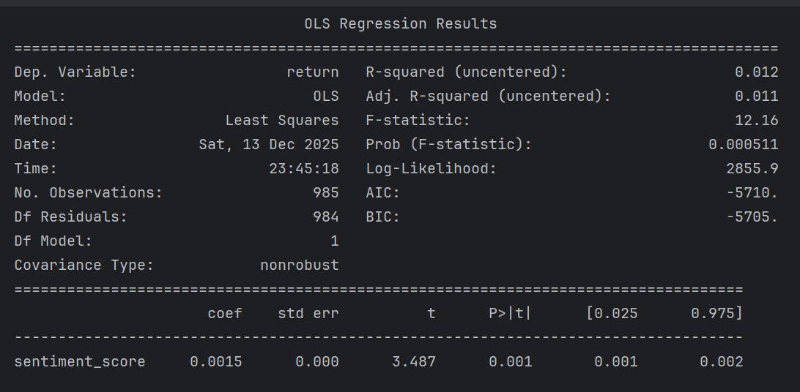
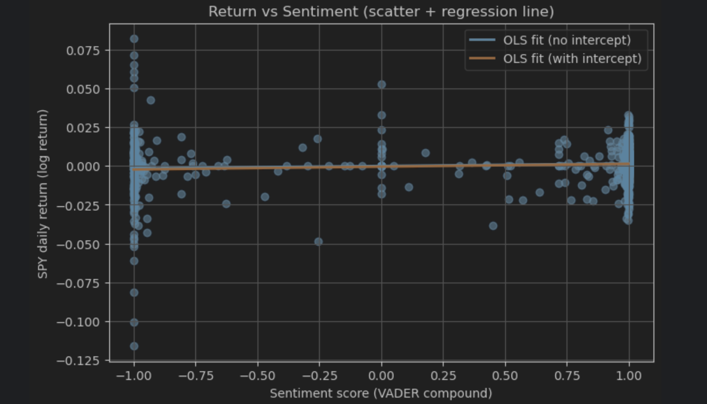

# Social Media Sentiment and Stock Market Returns  
### Evidence from Reddit Discussions and SPY (2018–2022)

## Project Overview
This project investigates whether investor sentiment expressed on social media is related to stock market performance.  
Using Reddit discussions related to the SPY ETF from 2018 to 2022, a daily sentiment index is constructed through sentiment analysis, and its relationship with SPY daily returns is examined using regression models.

The project focuses on transforming unstructured text data into a quantitative sentiment indicator and empirically testing its relevance in financial markets.

---

## Data Source
The data used in this project come from the Kaggle dataset:

**reddit_SPY_latest_comments_2018-2022**

- Time period: January 2, 2018 – March 11, 2022  
- Data contents:
  - Reddit comments discussing SPY and market-related topics
  - Daily SPY price data

Using a single dataset ensures consistency in time coverage and avoids time alignment issues across multiple sources.

---

## Sentiment Analysis
Investor sentiment is extracted from Reddit comments using **VADER (Valence Aware Dictionary and sEntiment Reasoner)**, which is specifically designed for analyzing social media text.

- Each Reddit comment is assigned a compound sentiment score ranging from:
  - **-1** (extremely negative)
  - **0** (neutral)
  - **+1** (extremely positive)

### Daily Sentiment Index Construction
- Sentiment scores from all comments posted on the same day are averaged
- This produces a **daily sentiment index**, capturing the overall mood of Reddit investors on each trading day

---

## Stock Return Calculation
Market performance is measured using **daily SPY log returns**.

- Returns are calculated as the logarithmic difference between consecutive daily prices
- Log returns are commonly used in financial research because they better represent relative price changes and help stabilize variance

---

## Methodology
Two regression approaches are applied to analyze the relationship between sentiment and stock market returns:

- **Ordinary Least Squares (OLS) Regression**, focusing on statistical inference
- **Linear Regression**, used primarily for visualization and trend confirmation

---

## Results

### OLS Regression Results
The figure below reports the Ordinary Least Squares (OLS) regression results examining the relationship between daily Reddit sentiment and SPY log returns.

The estimated coefficient on the sentiment index is positive and statistically significant, indicating that higher investor sentiment is associated with higher average market returns.  
The R-squared value is relatively low, which is common in daily financial return data due to high volatility and market noise.

---

### Return vs. Sentiment
The figure below illustrates the relationship between daily SPY log returns and Reddit sentiment scores.

Each point represents one trading day.  
The fitted regression line slopes slightly upward, suggesting a positive relationship between investor sentiment and stock returns.  
However, the wide dispersion of data points indicates that sentiment alone explains only a small portion of daily return variation.

---

## Interpretation
- Social media sentiment contains **statistically detectable information** about market movements
- The explanatory power of sentiment alone is limited
- Investor sentiment should be viewed as a **supplementary indicator** rather than a standalone prediction tool

---

## Tools and Technologies
- Python
- Pandas, NumPy
- VADER Sentiment Analysis
- Ordinary Least Squares (OLS)
- Linear Regression
- Matplotlib

---

## Conclusion
This project provides empirical evidence that Reddit investor sentiment is positively associated with SPY daily returns from 2018 to 2022.  
While the effect size is small, the findings highlight both the potential and the limitations of using social media sentiment in financial analysis.
